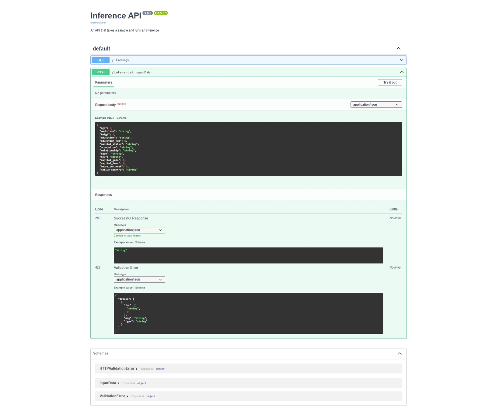
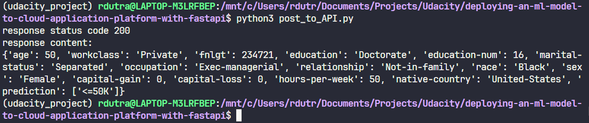
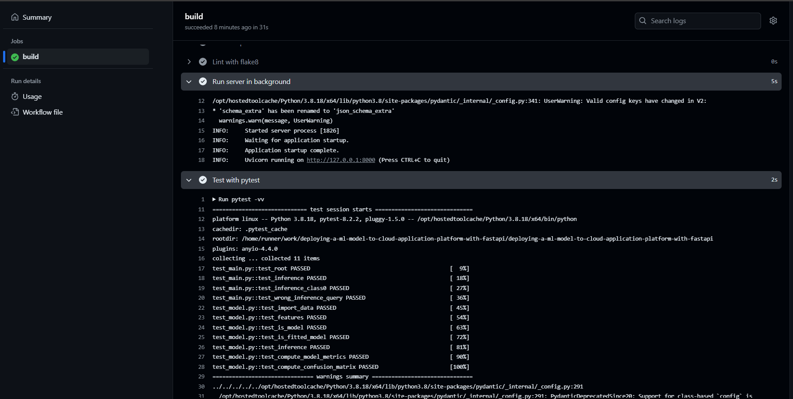
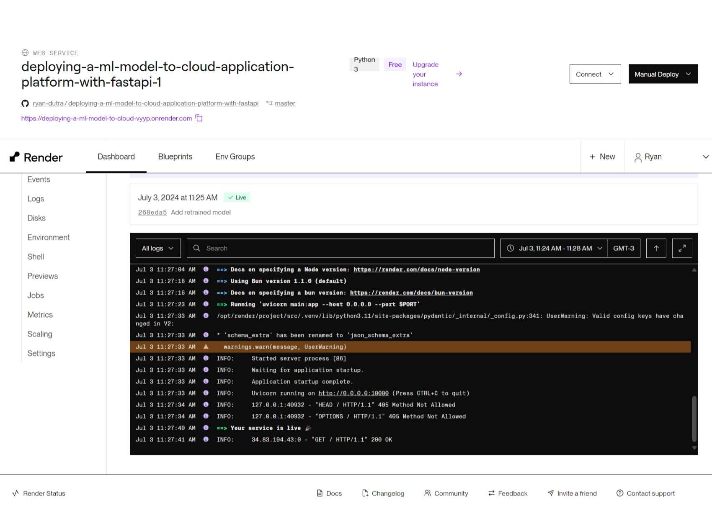

# Project Overview

This project is part of Udacity's ML DevOps Engineer nanodegree. The primary goal is to deploy a machine learning model using FastAPI on [Render](https://render.com/).

The project involves the following steps:
- Train a machine learning model to classify individuals into salary groups based on 14 different features, with a salary threshold of $50,000. Detailed information about the model and dataset can be found in the [Model Card](https://github.com/ryan-dutra/deploying-a-ml-model-to-cloud-application-platform-with-fastapi/blob/master/model_card.md).
- Expose the model for inference through a FastAPI application.
- Deploy the application on Render to provide an endpoint for inference.
- Set up a CI/CD pipeline using GitHub Actions and integrate it with Render, ensuring that the application is deployed only when automated tests pass.

# Using the API Client
* The `main.py` application is deployed to Render from the GitHub repository with CI/CD enabled. This means automatic deployments happen only when continuous integration checks pass.
* Essential files for Render include: `requirements.txt`, Python scripts, and saved models.
* Once deployed, accessing the Render app URL in a browser will display a welcome message.
* Inference can be performed using the `post_to_API.py` script, which sends a sample item (containing 14 features) to the app's inference endpoint. The prediction and the details of the submitted sample are returned. The `main.py` module handles inference using the trained model and One-Hot encoder saved in the `./model` directory.
* Illustrative screenshots can be found [here](https://github.com/ryan-dutra/deploying-a-ml-model-to-cloud-application-platform-with-fastapi/tree/master/model/screenshots).

# Environment and Setup
This project is executed under Windows WSL2. Python 3.8 is used within a virtual environment, with all necessary packages specified in the `requirements.txt` file, which is also used for Render deployment. Training results are logged, and screenshots document major project milestones.

## Inference FastAPI

## Inference Output from Endpoint

## CI/CD GitHub Actions Validation

## Render Web Service

Due to the lightweight nature of the dataset and model, no external storage was needed. However, for larger use cases, external storage with Azure Blob and DVC for versioning could be implemented.

Below are the initial project instructions for reference. Please refer to the repository for the actual implementation.

# Initial Project Instructions

Using a command line environment is recommended for ease of use with Git and DVC. If on Windows, WSL1 or 2 is advised.

# Environment Setup
* Download and install Conda if it is not already installed.
    * Use the supplied requirements file to create a new environment, or
    * `conda create -n [envname] "python=3.8" scikit-learn pandas numpy pytest jupyter jupyterlab fastapi uvicorn -c conda-forge`
    * Install Git either through Conda (`conda install git`) or via your CLI, e.g., `sudo apt-get install git`.

## Repositories
* Create a directory for the project and initialize Git.
    * Commit changes regularly as you work on the code. Models intended for production must be committed to GitHub.
* Link your local Git repository to GitHub.
* Set up GitHub Actions in your repository to run pytest and flake8 on push, ensuring that both pass without error.
    * Ensure that the GitHub Action uses the same Python version as your development environment.

# Data
* Download `census.csv` and commit it to DVC.
* The dataset is messy; attempt to load it with Pandas to identify issues.
* Clean the data using a text editor to remove all spaces.

# Model
* Using the starter code, develop a machine learning model that trains on the cleaned data and saves the model. Complete any pre-started functions.
* Write unit tests for at least three functions in the model code.
* Create a function that reports the model's performance on data slices.
    * Suggestion: for simplicity, focus on performance across categorical features.
* Draft a model card using the provided template.

# API Creation
* Build a RESTful API with FastAPI that includes:
    * GET on the root endpoint to display a welcome message.
    * POST to perform model inference.
    * Utilize type hinting.
    * Use a Pydantic model to process POST request bodies, including an example.
    * Hint: Handle hyphenated data names in the CSV without modifying them, using FastAPI/Pydantic functionalities instead.
* Write three unit tests for the API (one for GET and two for POST, covering each prediction).

# API Deployment
* Create a free Render account (use the web GUI or download the Render CLI for the following steps).
* Create a new app on Render and deploy it from your GitHub repository.
    * Enable automatic deployments, conditional on passing continuous integration checks.
    * Hint: Consider the difference in file paths between your local environment and Render.
    * Hint: Rapid development is key; pre-commit checks like flake8 can help avoid CI/CD failures.
* Write a script using the requests module to send a POST request to your live API.
